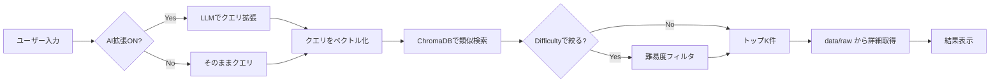

# AtCoder-RAG

AtCoder 過去問を対象にした RAG（Retrieval-Augmented）システムです。  
曖昧なキーワードで類似問題を検索し、タイトル・URL・難易度・アルゴリズム・キーワードを返します。

---

## ファイル構成（機能に関わるファイルのみ）

```
atcoder-RAG/
├── app.py                 # Streamlit エントリ（検索UI・検索実行・結果表示）
├── run_batch.py           # バッチ処理エントリ（指定範囲の一括DB構築）
├── src/
│   ├── __init__.py        # パッケージ初期化（load_config 等）
│   ├── config.py          # 定数・.env 読み込み・API URL・DB/raw/log パス
│   ├── models.py          # データ型（ProblemMeta, IntermediateProblem, GeminiExtract）
│   ├── atcoder_metadata.py # AtCoder Problems API からメタデータ・難易度取得
│   ├── scrape.py          # 問題文・公式解説のスクレイピング
│   ├── llm_extract.py     # Gemini でアルゴリズム・キーワード・要約を抽出
│   ├── embedding_db.py    # ChromaDB 操作・Gemini Embedding・upsert・結合テキスト生成
│   ├── query_expand.py    # 検索クエリの LLM 拡張（曖昧キーワード→専門用語列）
│   ├── retriever.py       # 検索オーケストレーション（拡張→ベクトル化→Chroma→難易度フィルタ→整形）
│   ├── auto_update.py     # 差分のみ DB に反映する自動更新（cron 想定）
│   └── logging_report.py  # ロギング・レポート出力（report.jsonl 等）
├── data/raw/              # 中間 JSON（問題文・gemini_extract）の保存先
├── logs/                  # ログ・レポート（app.log, report.jsonl, update_report.jsonl）
└── atcoder_rag_db/        # ChromaDB 永続化ディレクトリ（run_batch で生成）
```

---

## 機能の説明

| 機能 | 説明 |
|------|------|
| **一括DB構築** | `run_batch.py` でコンテスト範囲（例: abc126〜abc200, C〜F）を指定し、問題メタ取得→スクレイプ→LLM抽出→ベクトル化→ChromaDB に upsert。中間データは `data/raw/{problem_id}.json` に保存。 |
| **自動更新** | `auto_update.py` で ABC126 以降の新着問題のみ AtCoder Problems API と照合し、差分があればスクレイプ・LLM・upsert を実行。cron での定期実行を想定。 |
| **類似検索** | Streamlit（`app.py`）でキーワード入力→オプションで「AI クエリ拡張」・難易度フィルタ・トップK を指定して検索。ChromaDB のベクトル検索で類似問題を取得し、タイトル・URL・難易度・アルゴリズム・キーワードを表示。 |
| **クエリ拡張** | 曖昧な検索語（例:「最短経路」）を Gemini でアルゴリズム・専門用語に展開し、検索精度を向上。 |
| **難易度フィルタ** | 検索時に Difficulty の最小・最大を指定し、該当する問題のみに絞り込み。 |

---

## ユーザー入力から回答が返る仕組み（簡潔なフロー）



- **入力**: 検索キーワード（例:「ダイクストラ 最短経路」）とオプション（AI拡張・難易度範囲・トップK）。
- **処理**: 必要なら LLM でクエリを拡張 → Gemini Embedding でベクトル化 → ChromaDB で類似ドキュメントを取得 → 難易度でフィルタ → 中間 JSON からアルゴリズム・キーワードを付与して整形。
- **出力**: 問題ごとのタイトル・URL・難易度・アルゴリズム・キーワード・類似度（距離）。

---

## セットアップ・実行の目安

- `.env` に `GEMINI_API_KEY` を設定する。
- 初回は `run_batch.py` で DB を構築してから、`streamlit run app.py` で検索 UI を起動する。
- 依存は `requirements.txt` を参照。
