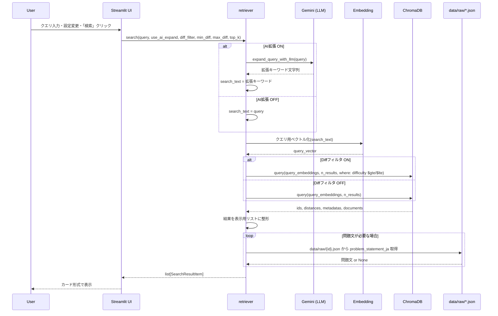
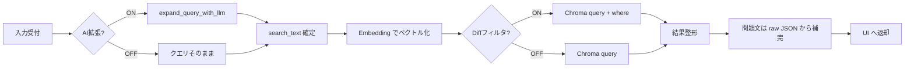
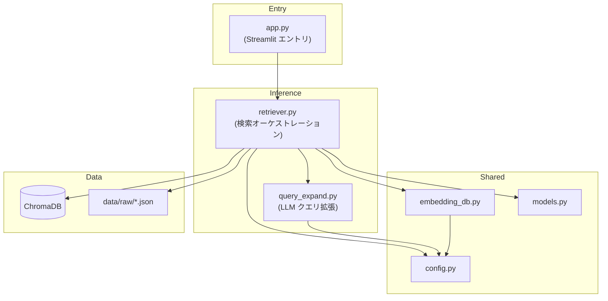

# AtCoder-RAG 推論ワークフロー 設計計画書

本ドキュメントは、`docs/inference_ui.md` の仕様に基づき、**ユーザークエリを受け取り適切な問題を返すワークフロー**の具体的な設計・実装計画を定める。大まかな設計・仕様は inference_ui.md から変更しない。`src/` 内の DB 作成パイプライン（`embedding_db.py`・`run_batch.py`・`config.py` 等）との整合性を確保する。

---

## 1. 参照仕様・前提

- **UI/処理フロー仕様**: `docs/inference_ui.md` の 1〜5 節（システム概要、画面レイアウト、処理フロー、モジュール・関数仕様案、クエリ拡張用プロンプト）をそのまま採用する。
- **DB・Embedding の資産**: `src/embedding_db.py`（`GeminiChromaEmbeddingFunction`、`get_chroma_client`、`COLLECTION_NAME`、`EMBEDDING_MODEL`）、`src/config.py`（`DEFAULT_DB_PATH`、`get_gemini_api_key`）、`run_batch.py` で使用している `COLLECTION_NAME = "atcoder_problems"` および中間データ `data/raw/{problem_id}.json` のスキーマ（`src/models.py` の `IntermediateProblem`）を前提とする。
- **技術制約**: `docs/pipeline_design.md` に記載の Gemini SDK（`google-genai`）、API キー（`.env`）、ChromaDB 永続化先（`./atcoder_rag_db`）を踏襲する。

---

## 2. ワークフロー全体像（図）

### 2.1 検索実行のシーケンス（ユーザー「検索」押下〜結果表示）



### 2.2 処理フロー（ステップ単位）



### 2.3 モジュール依存関係



---

## 3. ファイル構成と役割

### 3.1 新規作成するファイル

| ファイル | 役割 |
|----------|------|
| `src/retriever.py` | 検索オーケストレーション。`search_similar_problems` および、UI から呼ぶエントリ関数（例: `run_search`）を実装。クエリ拡張の ON/OFF、Embedding、ChromaDB query、結果整形までを一連で行う。 |
| `src/query_expand.py` | `expand_query_with_llm(query: str) -> str` を実装。Gemini に「アルゴリズム・キーワードのみ」を出力させるプロンプトを保持し、API を 1 回だけ呼ぶ。 |
| `app.py`（プロジェクトルート） | Streamlit のエントリポイント。サイドバー（AI拡張トグル、Difficulty フィルタ、トップK）、メイン（検索入力・検索ボタン・結果カード）を実装。`src.retriever` を呼び出して結果を受け取り表示する。 |

### 3.2 既存ファイルの利用・拡張

| ファイル | 利用・拡張方針 |
|----------|----------------|
| `src/embedding_db.py` | **利用**: `get_chroma_client`、`GeminiChromaEmbeddingFunction`、`COLLECTION_NAME` をそのまま利用。**拡張案**: クエリ用の 1 文字列ベクトル化は、現行の `EmbeddingFunction.__call__(input: list[str])` に `[search_text]` を渡して `__call__([search_text])[0]` で取得する。※ ドキュメント側は `task_type=RETRIEVAL_DOCUMENT` のため、クエリ用に `RETRIEVAL_QUERY` を分離するかは「不明点」に記載。 |
| `src/config.py` | **利用**: `get_gemini_api_key`、`DEFAULT_DB_PATH`、`DEFAULT_RAW_DATA_DIR` をそのまま利用。 |
| `src/models.py` | **利用**: `IntermediateProblem` で `data/raw/*.json` の読み込み型を揃える。**拡張**: 検索結果 1 件を表す型（例: `SearchResultItem`）をここに追加するか、`retriever.py` 内で TypedDict を定義するかは実装時に選択。 |

### 3.3 ディレクトリ構成（推論まわり抜粋）

```
atcoder-RAG/
├── app.py                    # 新規: Streamlit エントリ
├── src/
│   ├── retriever.py          # 新規: 検索オーケストレーション
│   ├── query_expand.py       # 新規: LLM クエリ拡張
│   ├── embedding_db.py       # 既存: そのまま利用（必要に応じ拡張）
│   ├── config.py             # 既存
│   ├── models.py             # 既存（必要なら SearchResultItem 追加）
│   └── ...
├── data/raw/                 # 既存: 問題文補完用
├── atcoder_rag_db/           # 既存: ChromaDB
└── docs/
    ├── inference_ui.md
    └── inference_workflow_design.md  # 本ドキュメント
```

---

## 4. モジュール仕様（具体的な関数・インターフェース）

### 4.1 `src/query_expand.py`

| 関数 | 役割 | 引数 | 戻り値 |
|------|------|------|--------|
| `expand_query_with_llm(query: str) -> str` | 曖昧な検索語句から「アルゴリズム名・データ構造・解法キーワード」を 5〜10 個程度、スペース区切りで生成する。 | `query: str`（ユーザー入力） | `str`（キーワードのみ、改行・解説なし） |

- **プロンプト**: inference_ui.md の「5. クエリ拡張用プロンプト仕様」に従う。システムプロンプトで「キーワードのみ出力」「文章・要約は含めない」と明記する。
- **API**: `google-genai` の `client.models.generate_content` を使用（`llm_extract.py` と同様に `get_gemini_api_key()` を利用）。モデルは `llm_extract.py` の `GEMINI_MODEL`（例: `gemini-2.5-flash`）を流用するか、別定数で短い応答用モデルを指定するかは実装時に決定。
- **エラーハンドリング**: 失敗時は元の `query` をそのまま返すか、空文字を返して呼び出し側でフォールバックするかを実装時に決める。

### 4.2 `src/retriever.py`

| 関数 | 役割 | 引数 | 戻り値 |
|------|------|------|--------|
| `search_similar_problems(...)` | ChromaDB で類似検索を実行する。 | `query_vector: list[float]`, `top_k: int`, `min_diff: int \| None`, `max_diff: int \| None`, （必要なら `db_path: str`） | `list[dict]`（後述の検索結果 1 件の辞書のリスト） |
| `run_search(...)`（名前は任意） | UI から呼ぶエントリ。入力パラメータを受け取り、クエリ拡張 → ベクトル化 → Chroma query → 整形まで一括で実行する。 | `query: str`, `use_ai_expand: bool`, `diff_filter_on: bool`, `min_diff: int`, `max_diff: int`, `top_k: int` | `list[dict]`（UI 表示用の同一形式） |

- **run_search の内部手順**  
  1. `use_ai_expand` が True なら `expand_query_with_llm(query)` で `search_text` を取得、False なら `search_text = query`。  
  2. `embedding_db.GeminiChromaEmbeddingFunction` で `search_text` を 1 件だけベクトル化（例: `emb_fn([search_text])[0]`）。  
  3. `get_chroma_client(db_path)` でクライアント取得、`get_or_create_collection(COLLECTION_NAME, embedding_function=emb_fn)` でコレクション取得。  
  4. Diff フィルタ ON のときは `where={"difficulty": {"$gte": min_diff, "$lte": max_diff}}` を付与。OFF のときは `where` なし。※ difficulty の型については「7. 不明点・確認事項」を参照。  
  5. `collection.query(query_embeddings=[query_vector], n_results=top_k, where=...)` を実行。  
  6. 返却された `ids`, `distances`, `metadatas`, `documents` を 1 件ずつ辞書にまとめ、アルゴリズム・キーワードはメタデータまたは中間 JSON から取得（後述）。問題文は DB に無ければ `data/raw/{id}.json` の `problem_statement_ja` を読みに行く。  
  7. 200 字要約は UI に表示しない（inference_ui.md 通り）。

- **検索結果 1 件の辞書（UI 表示用）**  
  - `title`, `url`, `difficulty`, `algorithms_keywords`（抽出アルゴリズム・キーワードをタグや箇条書き用に整形した文字列またはリスト）, `distance`（類似度スコア）, `problem_statement_ja`（任意・TBD の場合はキーを省略可能）

- **アルゴリズム・キーワードの取得**  
  - 現状 Chroma の `metadatas` には `title`, `url`, `difficulty` のみ。`algorithms` / `keywords` は `documents` の結合テキストに含まれるが、UI で「タグ・箇条書き」として出すには、検索結果の `id` で `data/raw/{id}.json` を読み、`gemini_extract.algorithms` と `gemini_extract.keywords` を表示する実装が現実的。DB 構築時にメタデータへ algorithms/keywords を追加する案は「7. 不明点・確認事項」に記載。

### 4.3 `app.py`（Streamlit）

- **サイドバー**:  
  - AI クエリ拡張: チェックボックス／トグル、初期値 ON。  
  - Difficulty フィルタ: 「Difficulty で絞り込む」チェック + 最小値・最大値の数値入力、初期値 絞り込み ON、最小 300、最大 700。  
  - 検索件数（トップ K）: 数値入力、初期値 5。

- **メイン**:  
  - テキスト入力 + 「検索」ボタン。  
  - 押下時に `retriever.run_search(query, use_ai_expand, diff_filter_on, min_diff, max_diff, top_k)` を呼ぶ。  
  - 返却リストをカード形式で表示: タイトル、URL（リンク）、Difficulty、アルゴリズム・キーワード、類似度（小さく）、問題文（TBD 対応時）。

- **起動**: `streamlit run app.py` で起動できるようにする。

---

## 5. DB・データとの整合性

### 5.1 ChromaDB

- **パス**: `config.DEFAULT_DB_PATH`（`./atcoder_rag_db`）を retriever でも使用する。  
- **コレクション名**: `embedding_db.COLLECTION_NAME`（`"atcoder_problems"`）をそのまま使用する。  
- **Embedding**: `embedding_db.GeminiChromaEmbeddingFunction` を retriever でインスタンス化し、クエリ文字列 1 件を `list[str]` で渡してベクトル 1 件を得る。

### 5.2 中間 JSON（`data/raw/{problem_id}.json`）

- **スキーマ**: `models.IntermediateProblem` に準拠。`problem_statement_ja`、`gemini_extract.algorithms`、`gemini_extract.keywords` を参照する。  
- **読み込み**: retriever 内で、検索結果の各 `id` に対し `Path(config.DEFAULT_RAW_DATA_DIR) / f"{id}.json"` を開き、存在する場合のみ問題文・アルゴリズム・キーワードを補完する。ファイルが無い場合は該当フィールドは省略または「取得できません」等の表示とする。

### 5.3 Difficulty フィルタとメタデータ型

- inference_ui.md では `where={"difficulty": {"$gte": min_val, "$lte": max_val}}` を想定している。  
- Chroma の `$gte` / `$lte` は**数値（int/float）専用**。一方、現行 `embedding_db.py` の `upsert_problems` では `difficulty` を **str** に変換して保存している（`str(difficulty) if difficulty is not None else ""`）。  
- **整合性の取り方**:  
  - **案 A**: DB 構築側を変更し、Chroma に **int** で保存する（None は Chroma が許容するならそのまま、許容しない場合は -1 などのセンチネル値や、where でフィルタしない運用にする）。  
  - **案 B**: 検索側で `where` は使わず、`n_results` を多めに取り、取得後に Python で difficulty を数値としてフィルタする（ただし類似度順がややずれる可能性あり）。  
- 採用案は「7. 不明点・確認事項」で確認する。

---

## 6. エラーハンドリング・運用

- **API キー**: 起動時に `config.load_config()` を呼び、未設定の場合は即失敗させる。  
- **ChromaDB 未構築**: コレクションが空、またはパスが存在しない場合は、UI で「DB がありません。先に run_batch で DB を構築してください」などのメッセージを表示する。  
- **クエリ拡張の失敗**: `expand_query_with_llm` が例外や空を返した場合は、元の `query` で検索を続行する。  
- **中間 JSON 欠損**: 該当 `id` のファイルが無い場合は、問題文・アルゴリズム・キーワードは「—」や非表示とする。

---

## 7. 不明点・確認事項（質問）

以下は与えられた資料だけでは詰めきれない仕様や、実装前に決めたい点です。確認をお願いします。

1. **Difficulty のメタデータ型とフィルタ**  
   - 現状 DB は `difficulty` を **文字列** で保存しており、Chroma の `$gte` / `$lte` は数値専用です。  
   - **質問**: (A) DB 構築側（`embedding_db.upsert_problems`）を変更して **int** で保存し、None は未設定扱い（where で数値範囲指定時は除外）とする方針でよいですか？ それとも (B) 検索側で where を使わず、取得件数を多めにしてアプリ側で difficulty をフィルタする方針がよいですか？

2. **クエリ用 Embedding の task_type**  
   - ドキュメント側は `task_type=RETRIEVAL_DOCUMENT` で保存しています。検索クエリは一般的に `RETRIEVAL_QUERY` の方が良いとされることがあります。  
   - **質問**: クエリのベクトル化も現行の `GeminiChromaEmbeddingFunction`（RETRIEVAL_DOCUMENT）のまま同じモデル・同じ task_type でよいですか？ それとも、クエリ用に `RETRIEVAL_QUERY` を指定する別関数を `embedding_db.py` に追加する方針にしますか？（利用 SDK で RETRIEVAL_QUERY が利用可能かは要確認）

3. **「抽出アルゴリズム・キーワード」の取得元**  
   - inference_ui.md では「DB のメタデータから取得」とありますが、現状 Chroma の metadatas には `title`, `url`, `difficulty` のみで、algorithms/keywords は入っていません。  
   - **質問**: 検索結果ごとに `data/raw/{id}.json` を読み、`gemini_extract.algorithms` / `keywords` を表示する実装でよいですか？ もしくは、今後 DB 構築時にこれらをメタデータ（例: カンマ区切り文字列や配列）で持たせる仕様変更を検討しますか？

4. **問題文（problem_statement_ja）の表示方針**  
   - inference_ui.md では「DB に本文がない場合はローカルの中間 JSON から読み込む」とあります。  
   - **質問**: 初版では「問題文」フィールドは非表示にして、まずはタイトル・URL・Difficulty・アルゴリズム・キーワード・類似度のみとし、問題文表示は後続タスクとする方針でよいですか？ それとも初版から問題文も表示（長文の場合は折りたたみや省略表示）を入れますか？

5. **Streamlit のポート・起動方法**  
   - **質問**: `streamlit run app.py` のほかに、ポート固定（例: `--server.port 8501`）や設定ファイル（`.streamlit/config.toml`）の用意まで本設計に含めますか？

6. **ログ・レポート**  
   - **質問**: 推論 UI での検索実行ログ（クエリ、件数、エラー有無）を `logs/` に追記する仕様にしますか？ する場合、`logging_report.py` の既存仕様に合わせて 1 検索 1 行の JSONL などで出力する想定でよいですか？

---

## 8. 実装順序の提案

1. **Phase 1**: `src/query_expand.py` の `expand_query_with_llm` 実装と単体確認（入力文字列 → Gemini → キーワード文字列）。  
2. **Phase 2**: `src/retriever.py` の `search_similar_problems` と `run_search` 実装。embedding_db・config を利用し、Difficulty は「7」の回答に従って where またはアプリ側フィルタのどちらかで実装。  
3. **Phase 3**: 結果辞書に algorithms/keywords（と必要なら problem_statement_ja）を raw JSON から補完する処理を追加。  
4. **Phase 4**: `app.py` で Streamlit UI を実装し、retriever と接続。  
5. **Phase 5**: エラーハンドリング・メッセージ整備と、必要に応じてログ出力の追加。

---

以上が、ユーザークエリを受け取り適切な問題を返すためのワークフローの具体的な設計計画である。不明点への回答をもらったうえで、上記の順序で実装に落とし込むことを推奨する。


## 不明点への返答(実装に着手する前に必ずコレを参照して実装に反映させてください)

1. ChromaDBの検索機能（where）は使わず、「まず類似度順に少し多め（例: 20件）にChromaDBから取得し、Streamlit（Python）側で difficulty を数値に変換して300〜700のものだけを上から5件表示する」というロジックにしてください

2. 検索クエリ用に task_type="RETRIEVAL_QUERY" を指定する別関数を embedding_db.py に追加してください

3. 検索でヒットしたIDをもとに、data/raw/{id}.json を読み込んで gemini_extract の中身をUIに表示する実装にしてください

4. 問題文の表示はなしで進めてください

5. 設定ファイルは不要です。デフォルトの起動方法で問題ありません

6. 推論UIでの検索実行ログは不要です。実装をシンプルにしてください
